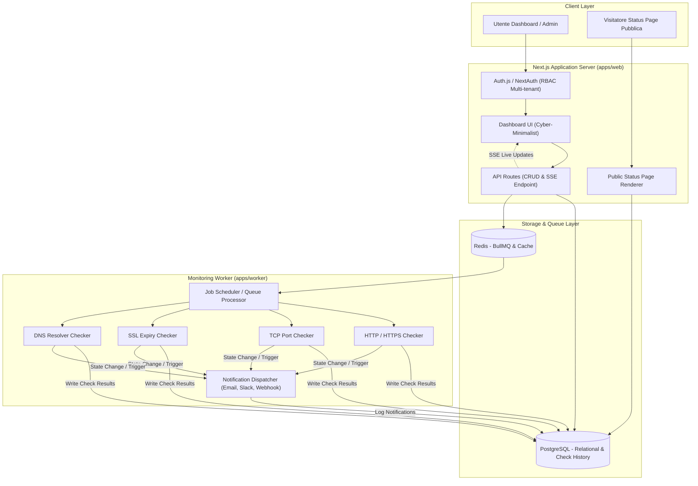

# AshenHost Architecture 🏛️

## Panoramica dei Componenti

L'architettura di AshenHost Status è concepita per garantire massima affidabilità nel monitoraggio, isolamento multi-tenant e aggiornamenti reattivi.

---

## 1. Applicazione Web (`apps/web`)
- **Next.js App Router**: Gestisce l'interfaccia utente, le route di autenticazione e gli endpoint REST.
- **Server-Sent Events (SSE)**: Streaming in tempo reale dello stato dei monitor e dei check senza sovraccaricare il database.
- **Multi-Tenancy**: Ogni richiesta è contestualizzata sull'organizzazione attiva dell'utente loggato.

## 2. Worker Engine (`apps/worker`)
- Processo Node.js TypeScript indipendente scalabile orizzontalmente.
- **BullMQ**: Gestisce la coda di esecuzione dei check con frequenze configurabili per monitor.
- **Moduli di Check**:
  - `HTTP/HTTPS`: Valida status code, tempo di risposta e payload.
  - `Ping/ICMP & TCP Port`: Valida connettività socket a porte arbitrarie.
  - `SSL Certificate`: Ispeziona la validità e la data di scadenza del certificato TLS.
  - `DNS`: Verifica la risoluzione dei record (A, AAAA, CNAME, TXT, MX).

## 3. Database & Caching
- **PostgreSQL 16**: Conserva entità relazionali (Organizzazioni, Membri, Monitor, Incidenti, Canali di notifica) e lo storico serie temporale dei Check con indici su `[monitorId, timestamp DESC]`.
- **Redis 7**: Fornisce il backend persistente per BullMQ, lock distribuiti e coordinamento tra worker multipli.
