# AshenHost Data Model & Entity Relations 📊

Il database di AshenHost Status è gestito tramite **Prisma ORM** con PostgreSQL.

## Diagramma Relazionale (ERD)

```mermaid
erDiagram
    ORGANIZATION ||--o{ MEMBERSHIP : "has"
    ORGANIZATION ||--o{ MONITOR : "owns"
    ORGANIZATION ||--o{ INCIDENT : "manages"
    ORGANIZATION ||--o{ STATUS_PAGE : "publishes"
    ORGANIZATION ||--o{ NOTIFICATION_CHANNEL : "configures"

    USER ||--o{ MEMBERSHIP : "participates_in"
    
    MONITOR ||--o{ CHECK : "records"
    MONITOR ||--o{ INCIDENT : "associated_with"

    INCIDENT ||--o{ INCIDENT_UPDATE : "contains"
    NOTIFICATION_CHANNEL ||--o{ NOTIFICATION_LOG : "generates"

    ORGANIZATION {
        string id PK
        string name
        string slug UK
        string plan
        datetime created_at
    }

    USER {
        string id PK
        string email UK
        string name
        string password_hash
        datetime created_at
    }

    MEMBERSHIP {
        string id PK
        string user_id FK
        string organization_id FK
        enum role "admin | member | viewer"
    }

    MONITOR {
        string id PK
        string organization_id FK
        string name
        string url
        enum type "http | ping | tcp_port | ssl_cert | dns"
        int interval_seconds
        int timeout_seconds
        string_array regions
        int_array expected_status_codes
        enum status "up | down | degraded | paused"
        datetime last_checked_at
        int consecutive_fails
        int consecutive_passes
    }

    CHECK {
        string id PK
        string monitor_id FK
        datetime timestamp
        int response_time_ms
        int status_code
        boolean success
        string error_message
        string region
    }

    INCIDENT {
        string id PK
        string organization_id FK
        string monitor_id FK "nullable"
        string title
        enum status "investigating | identified | monitoring | resolved"
        boolean is_manual
        datetime started_at
        datetime resolved_at
    }

    INCIDENT_UPDATE {
        string id PK
        string incident_id FK
        string message
        enum status "investigating | identified | monitoring | resolved"
        datetime created_at
    }

    STATUS_PAGE {
        string id PK
        string organization_id FK
        string name
        string slug UK
        string custom_domain UK
        string_array monitor_ids
        boolean is_public
    }

    NOTIFICATION_CHANNEL {
        string id PK
        string organization_id FK
        string name
        enum type "email | slack | webhook"
        json config
        boolean is_active
    }
```

---

## Indici e Ottimizzazioni per Serie Temporali

La tabella `Check` subisce un volume continuo di scritture e query aggregate (percentuale di uptime negli ultimi 90 giorni, tempi di risposta medi e heartbeat bars).

- `@@index([monitorId, timestamp(sort: Desc)])`: Permette query immediate per gli ultimi N check di un monitor specifico.
- `@@index([timestamp(sort: Desc)])`: Per pulizie periodiche (data retention / archiving) e metriche globali.
